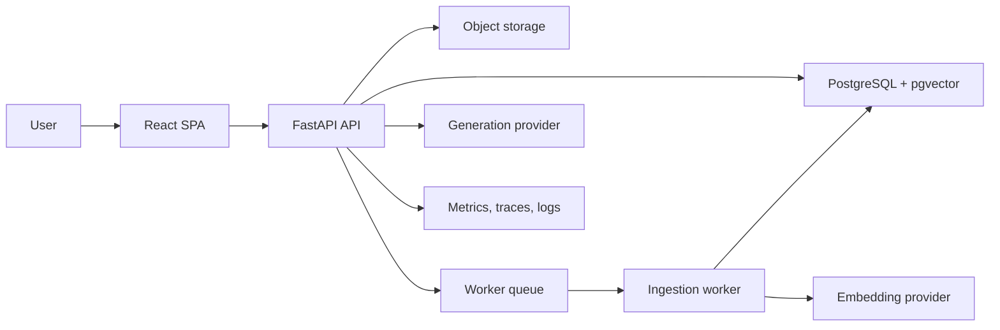

# Architecture

The platform is a modular monolith for v1:

- `frontend/` contains the React + TypeScript + Vite SPA.
- `backend/` contains the FastAPI application and domain services.
- `database/` contains PostgreSQL + pgvector DDL and seed data.
- `docker-compose.yml` runs API, worker, frontend, Postgres/pgvector, and Redis.

## Runtime flow

## Retrieval flow

1. Build an authorization scope from organisation, role, department, and document space.
2. Embed the query.
3. Retrieve candidate chunks with pgvector cosine search.
4. Optionally combine exact lexical matches for clause numbers and named controls.
5. Pack context with title, section, page, and rank metadata.
6. Generate an evidence-only answer.
7. Persist the answer and normalized citations.

## Prompt contract

The answer service must:

- Answer only from supplied context.
- Abstain when evidence is insufficient.
- Cite every material claim with document title and page.
- State conflicts when authorised documents disagree.
- Avoid inventing policy names, dates, or thresholds.

